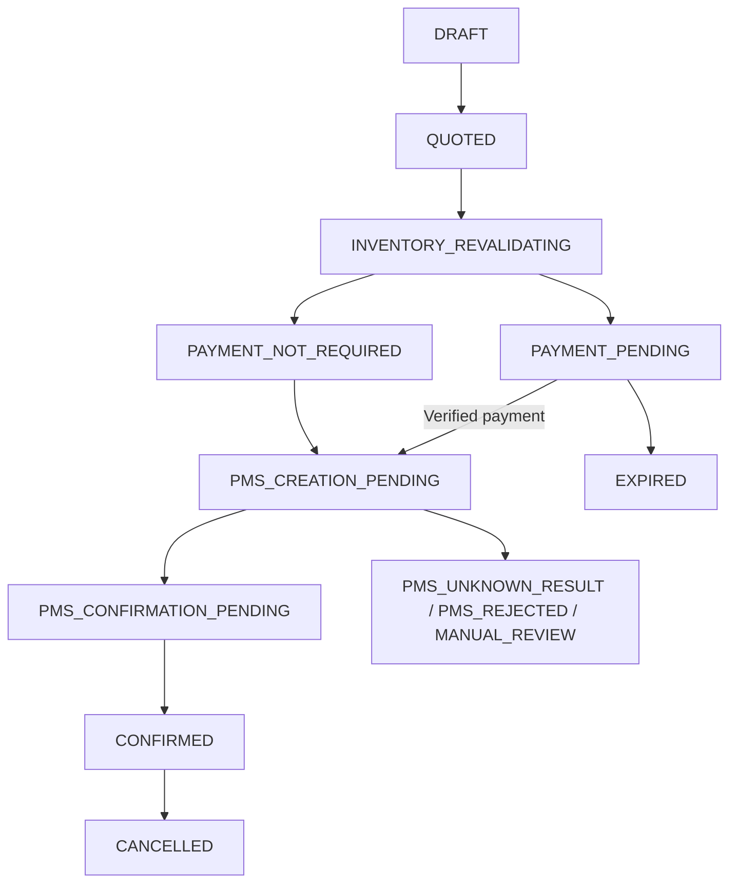

# Booking, inventory and guest payments

Status: **IMPLEMENTED**, with partial provider guarantees identified below. Code inspected 2026-09-19. Paths are repository-relative.

## Main entry points

| Concern | Source |
| --- | --- |
| Guest single booking and order endpoints | `apps/api/src/booking/booking.controller.ts` |
| Staff creation/cancellation | `booking/staff-booking.controller.ts` under the same API source root |
| Checkout orchestration, payment continuation, cancellation/expiry | `booking/local-pms.provider.ts` |
| Multi-room reservation | `booking/multi-room-booking.service.ts` |
| Pricing, rules and signed snapshot | `booking/quote.service.ts` |
| Inventory and physical-room claims | `tenancy/availability.service.ts` |
| State graph and projection | `booking/booking-state-machine.ts`, `booking/booking-projection.service.ts` |
| Verified gateway events, settlement, refunds | `payments/` |
| Clock fulfillment | [Clock lifecycle](../integrations/clock/booking-lifecycle.md) |

## Inventory and pricing

A stay occupies nights from `startsOn` through the day before `endsOn`. Room-type stock is `inventory_units.available_units - booked_units`, not the raw configured capacity. Missing nights cannot provide sellable stock. Database checks prevent negative or over-capacity booked counts.

Physical rooms use `room_availability`; manual blocks can target an entire property, room types, specific rooms, or combined targets. Modes are `ROOM_TYPE_ONLY`, `INDIVIDUAL_ROOM_ONLY`, and `MIXED`. Local MIXED auto-assignment requires same-price candidates. Inspect reservation SQL/locks and the last-unit/physical-room concurrency tests before changing this logic.

Local pricing resolves each night from a rate plan: nullable-date base rule, dated override with weekday conditions, then an optional room price override. Every night must be priced. Managed cancellation policies attach to rate plans. Clock-mapped types have a shadow local rate plan for relational bookkeeping, but their guest prices come from Clock `/products`, not local rate rules.

QuoteService creates a signed, session-bound snapshot (default 15 minutes) of scope, stay, selection, amount, nightly breakdown and normalized occupancy. Adults/children are primary; `guestCount` is a compatibility total. Validation checks expiry, signature, session binding and input consistency. Display-price caches are advisory and do not replace a quote or the final check.

## Creation and payment lifecycle

The exact allowed graph is `BOOKING_STATUS_TRANSITIONS`; this diagram omits failure/cancellation edges for readability. Check-in/out are not distinct MUST BookingStatus values.

LocalPmsProvider validates catalog/mode/rules, quote and guest identity, reserves inventory under a scoped transaction, and selects an enabled payment method. A zero total may be FREE; a non-zero stay cannot silently become free because a gateway is unavailable. Guest-visible Stripe/PokPay options require the property toggle plus an enabled CONNECTED integration. Pay-at-hotel is an explicit option.

For online single bookings, an uncached Clock check runs before creating the checkout session: room types use rate availability, while physical rooms use overlap-list/detail reads. On failure the creation transaction is rolled back. This is not an inventory hold at Clock and cannot eliminate a sale race between the check and later payment. Multi-room online orders run the same uncached check for every room before checkout: all selected physical rooms share one Clock overlap read, and unassigned rooms are checked per room type and occupancy, requiring Clock to report at least as many free units as the order requests of that type. Pay-at-hotel orders (single or multi-room) create the Clock reservation immediately instead of pre-checking.

Online payment confirmation writes the charge and calls `continueAfterPayment`. Local-only bookings confirm locally; Clock properties attach the real reservation after verification and then attempt deposit posting. Pay-at-hotel/free flows attach without a gateway charge. A successful payment and a failed PMS operation are distinct outcomes requiring staff attention, not proof of confirmation.

## Guest payments and refunds

`PaymentProviderRegistry` chooses Stripe or PokPay using tenant/property credentials. Stripe verifies the webhook against the connection and payment details; PokPay re-reads the authoritative order rather than trusting browser/callback fields. Return pages are display/continuation surfaces, never payment proof.

The `payments` ledger records positive-valued CHARGE/REFUND rows, with provider IDs and currency, and deduplicates external payment IDs within the tenant. `payment_provider_sessions` preserves multiple checkout sessions for the same booking (including resent PokPay links). Staff can record cash/card-in-person/bank-transfer payments; a paid pending booking reuses fulfillment.

`PaymentExpiryService` runs every minute, polls pending PokPay orders, then expires up to 100 candidates older than 30 minutes. It rechecks/locks state in tenant transactions and releases reserved inventory, including pending siblings of an order. Late authoritative payments require the provider-specific handling; do not assume expiry cancels a gateway session.

Cancellation is orchestrated through LocalPmsProvider, including Clock cancellation, local inventory release and refund policy. It uses the captured cancellation policy/window, authenticated staff context or a signed guest cancellation link. `PaymentRefundService` handles automatic refunds and staff full/fixed/percentage refunds with notes, remaining-balance checks, locking and idempotency. A staff percentage is a share of what is still refundable, not of the original charge (50% after a 50.00 refund of a 250.00 payment is 100.00, decided 2026-10-01); a fixed amount is capped at what is left, and the refund dialog shows the exact amount before it is confirmed. Every provider refund must reach the ledger under its own payment id: PokPay returns the order's one transaction id for all of its refunds, so the PokPay provider derives a per-refund id from the idempotency key.

For Clock-attached manual refunds, mirroring happens after the local refund transaction; failures produce manual review and do not reverse a completed refund. Clock requires a human Deposit Adjustment step: see the [Clock lifecycle](../integrations/clock/booking-lifecycle.md). No general settlement/payout system exists.

## Multi-room and concurrency boundaries

MultiRoomBookingService locks the selected room-type inventory in deterministic order and reserves the group in one transaction before proceeding. Children share an order reference; online payment is anchored to one booking for the aggregate amount. Fulfillment/cancellation fans out per room. External Clock operations cannot be rolled back as one atomic group: successfully cancelled children remain cancelled and failed siblings retain manual-review evidence.

Creation/update/cancellation/refund paths use `integration_operations`: tenant-scoped idempotency key, request hash, stored result and attempts, with conflict on key reuse for a different request. Booking `version` is an independent optimistic counter; Clock's `lock_version` is fetched for vendor updates. No database transaction makes a payment or Clock HTTP request atomically commit with local storage.

Outbound HTTP still occurs in some interactive transactions (30-45 second overrides). Review timeout/commit ambiguity and recovery using real behavioral tests; a typecheck does not establish idempotency under failure.

## Current gaps relevant to planning

- Public `PATCH /tenants/:tenantId/properties/:propertyId/bookings/:bookingId` forwards expectedVersion/total, not stay dates, even though provider methods can update dates. A staff date-change feature is not already exposed.
- Clock webhook hydration writes projections directly and does not run the full local booking transition/inventory/refund orchestration. A mirrored Clock cancellation is not proof of a MUST refund or released local inventory.
- Group availability/payment-accounting semantics need their own checks; do not project single-room guarantees onto orders. Clock reconciliation currently selects bookings with a local charge, while an order charge is anchored.
- Final price, reservation, charge, refund and folio balance are separate facts. See [Clock review gaps](../integrations/clock/architecture.md#known-gaps-and-deviations) before planning a provider change.
