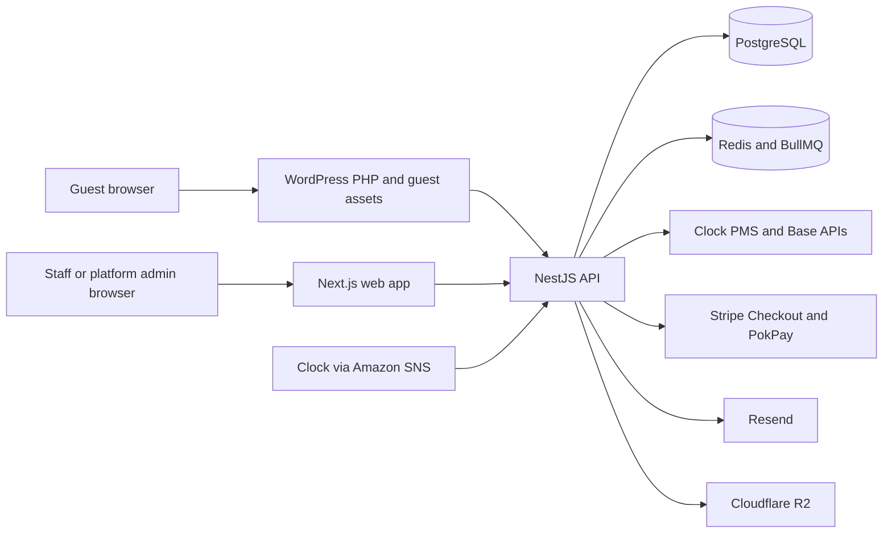

# Current system architecture

Status: **IMPLEMENTED**, with deviations called out below. Code inspected 2026-09-19.

## Runtime boundaries

The API is a modular monolith. Controllers, services, adapters and workers are registered in [AppModule](../../apps/api/src/app.module.ts); domain directories are organizational boundaries, not separately deployed Nest modules. BullMQ workers start inside the API process via lifecycle hooks. No separate worker application is present.

[main.ts](../../apps/api/src/main.ts) initializes Pino and Sentry, enables raw request bodies for payment verification, and installs a special JSON parser for Clock SNS deliveries sent as `text/plain`. There is no global Swagger/OpenAPI generator or universal DTO validation pipeline wired there; controllers/services perform their own parsing and validation.

## Repository and module map

All paths below are relative to the repository root.

| Path | Responsibility / first files to inspect |
| --- | --- |
| `apps/api/src/auth/` | `auth.service.ts`, `auth.controller.ts`: signup, Redis sessions/tokens, email verification |
| `apps/api/src/tenancy/` | Tenant transactions/guards, properties, room types/rooms, availability, rates, staff, guests, reports, notifications and pairing |
| `apps/api/src/booking/` | `local-pms.provider.ts` owns checkout orchestration; `quote.service.ts`, `multi-room-booking.service.ts`, state machine and projections |
| `apps/api/src/payments/` | Guest providers/registry, authoritative callbacks, expiry, manual settlement, refunds |
| `apps/api/src/integrations/` | Connection CRUD/property assignment, AES-256-GCM credential cipher, manual review |
| `apps/api/src/integrations/clock/` | Clock HTTP/Digest stack, catalog, availability, booking, webhook hydration and reconciliation |
| `apps/api/src/platform/` | Platform-admin oversight, allowlisted tenant operations, provider health |
| `apps/api/src/mail/`, `storage/`, `observability/` | Resend messages, R2 uploads, logging/error reporting |
| `apps/api/prisma/` | Prisma schema **and** SQL migrations, including RLS, partial indexes, triggers and privileged functions |
| `apps/web/app/` | Next App Router, auth pages, tenant dashboard, platform pages, payment-return pages |
| `apps/wordpress-plugin/` | PHP templates, guest JS, Elementor widgets, MUST API relay, configuration and release updater |
| `packages/domain-contracts/src/index.ts` | `PmsProvider`, `PaymentProvider`, `MailProvider`, `StorageProvider`, booking/money types; `BillingProvider` remains an unknown-typed stub |
| `packages/shared-types/src/index.ts` | Small tenant/property context and health types; not a complete generated API client |
| `packages/ui/src/` | Shared React primitives, shell, StatePanel, StatusBadge, tokens/styles |
| `infrastructure/containers/`, `.github/workflows/` | Docker/deploy artifacts, CI and WordPress release packaging |

## Actual stack

The manifests specify Node >=22, pnpm 10 (package manager pinned at root), NestJS 11, Prisma 6/PostgreSQL, Redis clients and BullMQ 6. Web uses Next 16, React 19, TanStack Query/Table, ECharts, Lucide and Sonner. See package manifests for exact versions rather than copying version pins here.

React Hook Form, a generated OpenAPI contract, a managed secret service, and a general metrics backend appear in early design intent but are not installed/wired as described there. Docker stack artifacts use PostgreSQL and Redis containers; a claim of managed production services requires deployment evidence.

## Provider seams and current coupling

`PmsProvider` and `PaymentProvider` are real contracts. `PmsProviderRegistry.forProperty` selects Clock for an enabled connected Clock property and local otherwise. Nevertheless, "all booking code talks only to the PMS port" is **intent, not the current implementation**:

- `PMS_PROVIDER` is still bound to `LocalPmsProvider` in AppModule.
- Single guest/staff creation and cancellation use LocalPmsProvider for quote, inventory, payment and refund orchestration.
- LocalPmsProvider directly injects Clock booking/availability services. MultiRoomBookingService, QuoteService and PaymentRefundService also have Clock-specific dependencies.
- Public availability and booking updates use provider selection in their respective controllers. Do not route all creation or cancellation through ClockPmsProvider: that would omit local orchestration.
- Direct vendor HTTP remains inside the adapter/provider infrastructure; frontend code does not hold Clock or guest-gateway credentials.

This coupling is a future architecture concern, not authorization for a refactor. [ADR-0001](../decisions/ADR-0001-monorepo-and-stack.md) and the [source brief](../source/README.md) remain the intended boundaries.

## Data and operational authority

PostgreSQL owns MUST bookings, operation records and the guest-payment ledger. A connected Clock property gets live provider prices and final availability checks; webhook hydration maintains local booking/folio projections. Cached search results cannot guarantee inventory. External writes and local transactions are not one distributed transaction: failures can require manual review, and some outbound calls still occur inside long database transactions.

Read [data/access](data-and-access.md), [booking/payments](booking-and-payments.md), [frontends/API](frontends-and-api.md), and [Clock](../integrations/clock/architecture.md) only as needed. Scheduled jobs and verification commands are routed through [operations](../operations/README.md).
